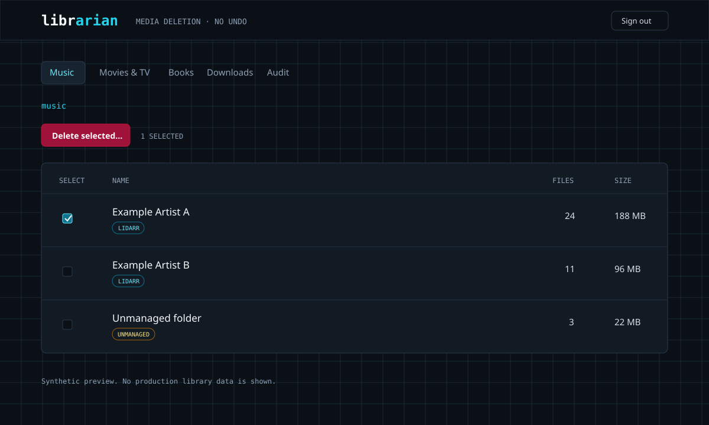

# Librarian

Librarian is a self-hosted deletion portal for media libraries. It shows what a deletion will touch before it changes anything, requires a typed confirmation, rejects stale plans, and records the attempt in an append-only audit log.

It supports:

- Music managed by Lidarr
- Movies and TV managed by Radarr or Sonarr
- Books stored on disk and indexed by Kavita
- Completed slskd download directories
- Hardlink discovery under configured download roots



## Why this exists

Deleting a file through one media application often leaves other state behind. A manager may still monitor the title, a download-side hardlink may retain the disk usage, or a source archive may survive elsewhere.

Librarian builds a plan that combines the filesystem with the relevant manager APIs. The preview lists paths, bytes, hardlinks, manager actions, warnings, and the confirmation phrase. Execution recomputes the plan and refuses to continue if either the files or intended actions changed.

## Safety model

This application permanently deletes files. There is no undo unless another system provides snapshots, recycling, or backups.

- Every target must resolve to a strict descendant of its configured library root.
- Symlinks, the library root, missing paths, traversal, and Syncthing control names are refused.
- Planning performs no writes or destructive API calls.
- The digest covers file metadata and every action target.
- Authentication fails closed when credentials are absent.
- Audit intent is written before deletion, followed by an outcome.
- The container binds to `127.0.0.1` by default.

Read [SECURITY.md](SECURITY.md) before mounting a real library.

## Quick start with empty directories

This verifies the interface without exposing media:

```bash
git clone https://github.com/arkhiVd/librarian.git
cd librarian
cp .env.example .env
```

Edit `.env` and replace `LIBRARIAN_BASIC_PASS`. For direct HTTP access restricted to the same machine, set:

```dotenv
LIBRARIAN_COOKIE_SECURE=false
```

Create a disposable library with three synthetic files, then start the service:

```bash
python scripts/create_demo.py
docker compose up --build
```

Open `http://127.0.0.1:8300` and use the Books view. The helper refuses to write into a non-empty `data/` directory. The generated `.epub` and `.rar` files are plain text, contain no copyrighted material, and exist only to exercise planning and deletion. Manager-backed views report missing API keys until configured.

Do not point the mounts at a real library until you have tested the full plan and confirmation flow with disposable files.

## Configuration

| Variable | Purpose | Default |
|---|---|---|
| `LIBRARIAN_BASIC_USER` | Login and HTTP Basic username | Required |
| `LIBRARIAN_BASIC_PASS` | Login and HTTP Basic password | Required |
| `LIBRARIAN_COOKIE_SECURE` | Require HTTPS for browser sessions | `true` |
| `LIBRARIAN_CONFIG_PATH` | Host directory for audit and revocation state | `./data/config` |
| `MUSIC_PATH` | Host music library | `./data/music` |
| `VIDEO_PATH` | Host root containing video and download trees | `./data/video` |
| `BOOKS_PATH` | Host book library | `./data/books` |
| `SLSKD_DOWNLOADS_PATH` | Host slskd download directory | `./data/slskd-downloads` |
| `LIDARR_URL`, `LIDARR_API_KEY` | Lidarr API v1 connection | Key disabled |
| `RADARR_URL`, `RADARR_API_KEY` | Radarr API v3 connection | Key disabled |
| `SONARR_URL`, `SONARR_API_KEY` | Sonarr API v3 connection | Key disabled |
| `SLSKD_URL`, `SLSKD_API_KEY` | slskd API v0 connection | Key optional |
| `LIDARR_MUSIC_ROOT` | Music path as reported by Lidarr | `/music` |
| `ARR_MEDIA_ROOT` | Media path as reported by Radarr and Sonarr | `/data` |

The URL defaults assume Librarian joins the same Docker network as the related service. Otherwise set URLs reachable from the container.

## How deletion works

1. The adapter walks one library root and joins files to manager records by full file path.
2. `POST /api/<library>/plan` resolves every target and returns ordered actions.
3. The browser displays the targets, byte counts, hardlink status, and warnings.
4. The user types the exact confirmation phrase.
5. `POST /api/<library>/execute` rebuilds the plan. A digest mismatch returns a stale-plan error.
6. Librarian records an audit intent, attempts each action, then records the outcome.

For music, managed files are deleted through Lidarr so its database remains consistent. For video, Librarian can unlink matching download-side hardlinks under configured roots. Book deletion can include a separately listed archive from `.originals/`.

## Development

Python 3.12 and Node.js are required for the local checks:

```bash
python3 -m venv .venv
.venv/bin/pip install -r requirements-dev.txt
.venv/bin/ruff format --check .
.venv/bin/ruff check .
.venv/bin/pytest -q
python scripts/create_demo.py --base /tmp/librarian-demo
node tests/test_jsq.js
python3 -c "import re; s=open('app/static/index.html').read(); open('/tmp/librarian.js','w').write(re.search(r'<script>(.*?)</script>',s,re.S).group(1))"
node --check /tmp/librarian.js
```

See [SPEC.md](SPEC.md) for the behavior contract and [CONTRIBUTING.md](CONTRIBUTING.md) for change requirements.

## License

MIT. See [LICENSE](LICENSE).
